# FL MiniMax H3

MiniMax H3 workflow nodes for ComfyUI. The pack adds strict prompt timelines, beat-aligned render planning, full-frame temporal reshots, optional cross-shot motion context, grouped and independent shot sampling, native latent upscaling, pixel-space refinement, and final shot assembly while preserving MiniMax H3's nested video/audio latent format.

[](https://github.com/Comfy-Org/ComfyUI)
[](https://www.patreon.com/Machinedelusions)

## Features

- **Strict prompt timelines** - Schedule prompt conditioning over H3 video tokens in seconds, frames, or beats
- **Reference-aware conditioning** - Use H3 reference images, videos, video audio, and standalone audio
- **Beat shot planning** - Turn an `FL_PROMPT_SCHEDULE` into independently renderable or explicitly grouped shots
- **Temporal reshots** - Move and resize a frame-exact interval on a source-video timeline, regenerate that entire span, and keep the rest of the clip intact
- **Hard-cut motion context** - Condition each render on a configurable authored tail from the previous render without showing overlap frames
- **Nested latent sampling** - Sample MiniMax H3 video and audio latents without flattening their native structure
- **Native latent upscaling** - Resize only video latent height and width without a VAE round trip
- **Unified sampler previews** - Watch sampling progress and completed base or upscale renders in one embedded player
- **Pixel-space refinement** - Decode, resize, re-encode, and refine through an explicit sampling-step window
- **Shot assembly** - Decode and concatenate planned renders in timeline order
- **Workflow compatibility** - Keeps the original Fill Nodes node IDs, sockets, custom types, and metadata

## Node reference

### Prompting and planning

#### FL MiniMax H3 Prompt Timeline

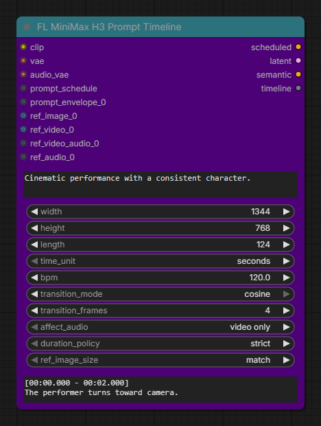

Creates the native nested H3 video/audio latent and its prompt conditioning. Use a manual timeline or connect an exact `FL_PROMPT_SCHEDULE`; a connected schedule takes precedence. Optional prompt envelopes and H3 image, video, soundtrack, and audio references are encoded into the same reusable timeline.

- **Important inputs:** H3 text encoder, video VAE, audio VAE, global prompt, manual or connected timeline, output dimensions and length, transition controls, reactive envelopes, and references.
- **Outputs:** strict `scheduled` conditioning for the first pass, native `latent`, fast `semantic` conditioning for refinement, and the reusable encoded `timeline`.

#### FL MiniMax H3 Apply Timeline

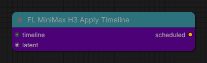

Rebuilds strict time-masked conditioning for an H3 latent whose spatial dimensions changed while its video and audio duration stayed the same. This is the bridge between **Latent Upscale** and a second standard sampler pass.

- **Inputs:** an encoded H3 `timeline` and the resized nested `latent`.
- **Output:** rebuilt `scheduled` conditioning at the latent's new spatial dimensions.

#### FL MiniMax H3 Beat Shot Planner

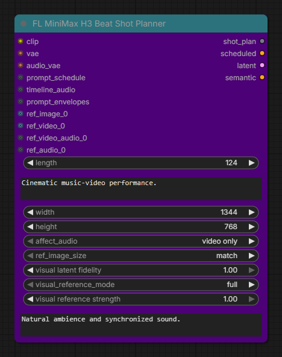

Converts an exact 24 fps beat prompt schedule into grouped or independent H3 render units and slices the matching timeline audio for each render. Without a connected schedule it plans one continuous render, making the node usable as a compact alternative to Prompt Timeline.

- **Important inputs:** H3 encoders, optional schedule and aligned audio, global prompt prefix and suffix, dimensions, audio-mask policy, visual-reference mode, reference strength and fidelity, reactive envelopes, and references.
- **Outputs:** the complete `shot_plan` plus the first render's `scheduled`, `latent`, and `semantic` values for standard-sampler workflows.

#### FL MiniMax H3 Shot Motion Context

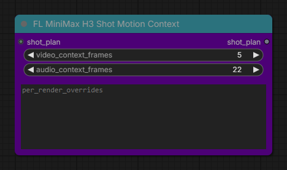

Carries a configurable authored video and audio tail from each completed render into the next render as hidden conditioning. The assembler removes that prefix, so visible shot boundaries remain hard cuts.

- **Inputs:** a `shot_plan`, an H3-native video context window, audio context measured on the 24 fps timeline, and optional per-render overrides such as `3: 22, 39`.
- **Output:** a metadata-preserving motion-context `shot_plan` for every downstream beat sampler.

### Sampling and refinement

#### FL MiniMax H3 Beat KSampler

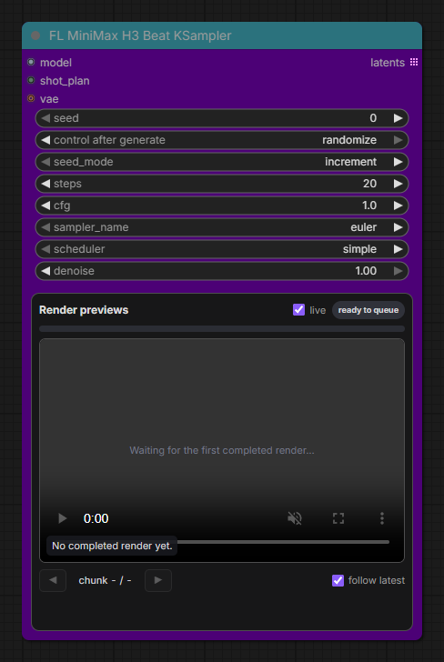

Samples every planned H3 render independently with fixed or incrementing seeds. The embedded dashboard follows live latent previews and can optionally decode a silent MP4 after each completed render.

- **Inputs:** H3 model, exact `shot_plan`, seed policy, sampler settings, and an optional video VAE required by visual motion context or completed-render previews.
- **Output:** one editable native H3 `latent` per planned render as a ComfyUI list output.

#### FL MiniMax H3 Beat Pixel Upscale KSampler

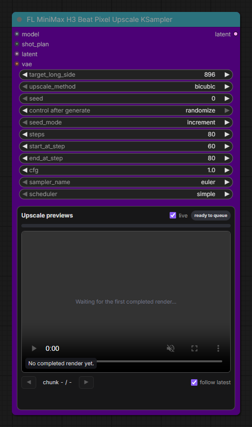

Processes each planned render through a video-VAE round trip: decode to pixels, resize proportionally, re-encode, rebuild conditioning, and sample only the configured portion of the refinement schedule. Audio and shot metadata are preserved.

- **Inputs:** H3 model, the exact source `shot_plan`, sampled latent list, video VAE, target long side, interpolation method, seed policy, and total/start/end sampling steps.
- **Output:** refined native H3 `latent` values ready for assembly or another metadata-preserving latent operation.

### Latent and output utilities

#### FL MiniMax H3 Latent Upscale

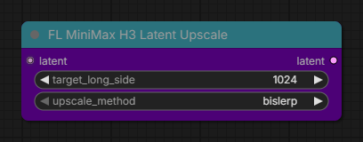

Interpolates only the spatial dimensions of the H3 video latent without decoding it. Temporal length, audio latent, noise masks, shot boundaries, reshot data, and other metadata are retained.

- **Inputs:** a native nested H3 `latent`, target pixel long side, and latent interpolation method.
- **Output:** spatially enlarged H3 `latent`. Use **Apply Timeline** before a refinement sampler.

#### FL MiniMax H3 Shot Assembler

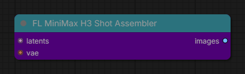

Decodes planned render latents separately, removes H3 padding and hidden motion-context prefixes, validates their timeline metadata, and concatenates the authored frames in order.

- **Inputs:** the complete H3 latent list and the H3 video VAE.
- **Output:** one `images` batch with hard cuts at the authored shot boundaries.

### Temporal reshooting

#### FL MiniMax H3 Temporal Reshot Planner

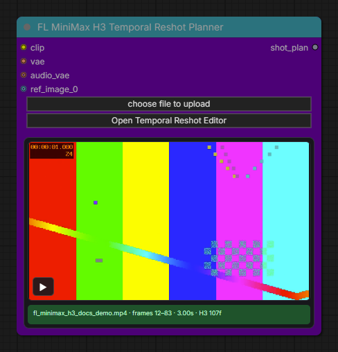

Normalizes a local source video to a 24 fps editing timeline and builds one source-anchored full-frame temporal inpaint plan. The compact node previews the selected range; the editor provides source browsing, exact frame controls, context handles, H3 alignment diagnostics, prompting, and reference sizing.

- **Inputs:** H3 text encoder and video VAE, local source video, replacement prompt, optional audio VAE, and optional reference images.
- **Output:** a one-render `shot_plan` with the source fingerprint, protected surrounding latent, replacement mask, context, and assembly metadata.

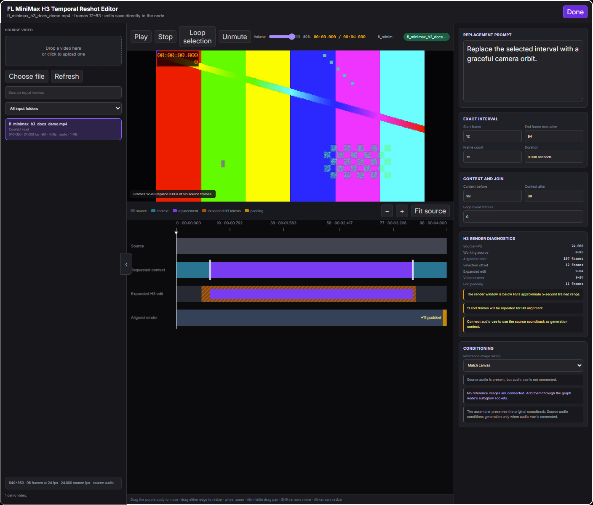

#### FL MiniMax H3 Temporal Reshot Assembler

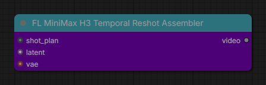

Decodes the sampled replacement, extracts the exact authored interval, and splices it into the original source. Frames outside the selection remain unchanged, and source audio, frame rate, metadata, alpha, and bit depth are retained.

- **Inputs:** the exact planner `shot_plan`, sampled H3 `latent`, and H3 video VAE.
- **Output:** a native ComfyUI `video` ready for **Save Video**.

## Installation

### ComfyUI Manager

Search for **FL MiniMax H3** and install the pack from the Comfy Registry.

### Manual

```bash
cd ComfyUI/custom_nodes
git clone https://github.com/filliptm/ComfyUI-FL-MiniMaxH3.git
```

Restart ComfyUI after installation.

## Example workflows

- [MiniMax H3 Manual Timeline](<example_workflows/MiniMax H3 Manual Timeline.json>) uses current ComfyUI and this pack. It demonstrates Prompt Timeline, native latent upscale, Apply Timeline, standard H3 sampling, video/audio decode, and Save Video.
- [MiniMax H3 Beat Scheduled](<example_workflows/MiniMax H3 Beat Scheduled.json>) adds [ComfyUI Fill Nodes](https://github.com/filliptm/ComfyUI_Fill-Nodes) for audio analysis and demonstrates beat planning, hard-cut motion context, independent sampling, pixel refinement, assembly, and final audio muxing.
- [MiniMax H3 Temporal Reshot](<example_workflows/MiniMax H3 Temporal Reshot.json>) uses current ComfyUI and this pack. Choose a local source in the planner, sample the replacement, and pass it to the source-preserving assembler.

The workflows contain portable output prefixes and no source media. Replace their model selections with compatible files available in your ComfyUI installation.

## Required ComfyUI support

This pack uses the MiniMax H3 implementation included with current ComfyUI. It does not bundle or download model weights.

A normal H3 workflow uses:

| Component | Typical model |
|-----------|---------------|
| Diffusion model | A supported MiniMax H3 `ref2va` diffusion model |
| Text encoder | MiniMax-compatible Qwen3-VL text encoder |
| Video VAE | `minimax_h3_video_vae_fp16.safetensors` |
| Audio VAE | `minimax_h3_audio_vae_fp32.safetensors` |

Use ComfyUI's standard model loaders and supported H3 model formats. Model files remain in the normal ComfyUI model directories.

## Quick start: one continuous H3 render

1. Load the H3 text encoder, video VAE, and audio VAE.
2. Add **FL MiniMax H3 Prompt Timeline**.
3. Connect any reference images, videos, or audio.
4. Enter the global prompt and timeline sections.
5. Connect `scheduled` to the first sampler.
6. Decode the resulting nested video and audio latent with the standard H3 VAEs.

Manual frame syntax:

```text
[0 - 48]
Wide establishing shot. The subject turns toward camera.

[48 - 96]
Hard cut to a low tracking shot as the subject moves forward.
```

Frame ranges are zero-based and their end is exclusive.

## Temporal reshot workflow

Use the reshot path when the edit is a span of time rather than an object mask:

```text
FL MiniMax H3 Temporal Reshot Planner
    -> FL MiniMax H3 Beat KSampler
    -> FL MiniMax H3 Temporal Reshot Assembler
```

1. Click **Open Temporal Reshot Editor**. Browse recursively under ComfyUI's input directory, search the local source library, or drop/upload a video into it. Sources at other frame rates, including variable-frame-rate videos, are normalized locally to a 24 fps editing timeline.
2. Drag the purple interval to move it, drag either edge to resize it, or enter exact frame values in the inspector. Wheel zooms the timeline; Alt-drag or middle-drag pans it.
3. Set source context before and after the selection. Teal shows retained context, purple is the exact replacement, and the hatched range shows any extra H3 temporal tokens that must be sampled coherently.
4. Enter the new prompt in the modal and connect optional reference images on the node. Connect the audio VAE when source sound should condition the new motion; the assembler always keeps the original soundtrack.
5. Close the editor with **Done** or Escape. Changes save directly to the node, whose compact preview loops the selected interval without taking over the graph canvas.
6. Sample the one-render plan with **FL MiniMax H3 Beat KSampler**, then connect that latent, the exact plan, and the video VAE to **Temporal Reshot Assembler**.

The sampler denoises full spatial frames only across the H3 tokens intersecting the selection. Source latent is re-injected everywhere else at every step. The assembler decodes the working window, extracts the exact authored interval, resizes it back to source dimensions, and overwrites only those source frames. `edge_blend_frames` optionally softens the two temporal joins inside the selected range; it never changes a frame outside it.

Current limitations are deliberate: one interval per planner, no spatial/object mask, and no latent or pixel-upscale pass between sampling and reshot assembly. The H3 working window snaps to the model's `17k+5` frame grid; the UI warns when it falls outside H3's approximate 124–362-frame trained range. The assembler materializes and normalizes the full source video in memory, so long or high-resolution sources require substantial system RAM.

## Beat-scheduled music-video workflow

The recommended audio-reactive path uses **FL Audio Beat Prompt Schedule** from [ComfyUI Fill Nodes](https://github.com/filliptm/ComfyUI_Fill-Nodes):

```text
FL Audio Beat Prompt Schedule
    -> prompt_schedule, audio, prompt_envelopes
    -> FL MiniMax H3 Beat Shot Planner
    -> optional FL MiniMax H3 Shot Motion Context
    -> FL MiniMax H3 Beat KSampler
    -> optional FL MiniMax H3 Beat Pixel Upscale KSampler
    -> FL MiniMax H3 Shot Assembler
```

Fill Nodes is recommended for this beat-sequenced path but is not required for the manual Prompt Timeline workflow.

The scheduler owns waveform analysis, beat-grid editing, audio trimming, prompt blocks, crossfades, render groups, and up to three live reactive-prompt envelopes. The H3 planner consumes `FL_PROMPT_SCHEDULE`, the aligned audio crop, and one `FL_PROMPT_ENVELOPE_SET` without importing or duplicating the audio implementation. It slices and rebases every reactive prompt for each planned shot.

## Render groups

The scheduler can mark touching prompt sections as one render group:

- Grouped sections are encoded and rendered together so H3 can model internal cuts with shared context.
- Ungrouped sections become independent renders.
- The sampler always returns one editable nested latent per planned render.
- The assembler restores the planned timeline order after sampling or refinement.

This provides explicit control over which cuts share generative context without forcing the entire music video into one long render.

## Hard-cut motion context

Place **FL MiniMax H3 Shot Motion Context** between the Beat Shot Planner and every beat sampler. Also connect the video VAE to the Beat KSampler's optional `vae` input when video context is nonzero.

- `video_context_frames` accepts H3-native context windows `0`, `1`, `5`, `22`, or `39`.
- `audio_context_frames` accepts `0` through `240` frames on the 24 fps video timeline.
- `per_render_overrides` uses 1-based destination renders, for example `3: 22, 39`.
- The first render has no previous context. A requested context cannot exceed the previous render's authored length.
- Context is generated as a hidden prefix, protected during pixel-upscale refinement, and removed by the Shot Assembler. The visible transition remains a hard cut.

The Beat KSampler installs a marker-scoped H3 hook through ComfyUI's model patcher on a cloned model; it does not modify ComfyUI files or the connected model. Workflows without this node take the original H3 path. The hook prepares the payload before diffusion-model wrappers, so it can run with Spectrum H3 enabled.

Larger video context can substantially increase the destination render length on H3's temporal grid. Start with 5 video frames and 22 audio frames. The example workflow is wired with those defaults. Its final video still uses the scheduler's original audio track; audio context guides joint generation but does not replace that muxed track.

## Prompt Timeline outputs

- `scheduled` - strict temporal conditioning for the initial sampling pass
- `latent` - native nested H3 video/audio latent
- `semantic` - single semantic conditioning suitable for low-denoise refinement
- `timeline` - reusable encoded timeline for **Apply Timeline**

Use **Apply Timeline** when a spatial resize or VAE round trip changes the video latent width and height but preserves its temporal dimensions.

## Native latent upscale

**FL MiniMax H3 Latent Upscale** interpolates the video stream directly in latent space. It preserves video duration, the original audio tensor, shot boundaries, motion-context metadata, and other latent dictionary fields. The target long side and proportional short side remain aligned to 32-pixel H3 canvases.

The node does not create detail by itself. Decode its output for a fast final enlargement, or rebuild conditioning with **Apply Timeline** before a low-denoise refinement pass. A 2x spatial upscale creates roughly 4x as many video tokens for downstream sampling.

```text
Base KSampler
    -> FL MiniMax H3 Latent Upscale
    -> FL MiniMax H3 Apply Timeline
    -> low-denoise KSampler
    -> decode
```

Use `bislerp` as the general latent interpolation method. The existing Beat Pixel Upscale KSampler remains the VAE round-trip refinement path.

## Pixel upscale refinement

**FL MiniMax H3 Beat Pixel Upscale KSampler** performs this sequence for each planned render:

1. Decode the video latent through the H3 video VAE.
2. Resize pixels proportionally to the requested long side.
3. Re-encode the resized frames into H3 latent space.
4. Reapply the render's prompt timeline at the new spatial dimensions.
5. Sample from `start_at_step` through `end_at_step` within the configured total `steps` schedule.

The output remains a native nested H3 latent so it can continue through other latent-aware ComfyUI nodes before decoding.

## Live chunk previews

The Beat KSampler and Beat Pixel Upscale KSampler use one embedded preview player for the full render lifecycle. The player shows ComfyUI's live latent preview while a chunk is sampling, then replaces it with that chunk's completed MP4 when **live** is enabled. Native and Video Helper Suite preview widgets are hidden only on these two FL samplers so the same preview is not repeated below the player.

Sampling previews follow ComfyUI's existing preview settings and add no extra model work. Completed MP4 generation is off by default and does not change sampler settings, latent outputs, shot metadata, or final audio. Enabling **live** adds one extra video-VAE decode and preview encode per completed render. Preview errors are shown in the dashboard without failing the latent render. A cached sampler does not regenerate completed previews.

The first Beat KSampler finishes its complete latent list before downstream nodes can start because ComfyUI list outputs are not streamed between nodes. Once the pixel-upscale sampler begins processing that list, its completed renders appear incrementally as well.

## Key parameters

- **length** - Requested video frame count at H3's fixed 24 FPS
- **affect_audio** - Apply scheduled text masks to video only or to video and audio tokens
- **duration_policy** - Reject, clamp, or fit schedule ranges that exceed the aligned H3 duration
- **ref_image_size** - Match the output canvas or allow H3's maximum reference area
- **global_prompt_suffix** - Append persistent trailing prompt sections after every scheduled and reactive prompt
- **target_long_side** - Pixel long side used by either upscale path; must be divisible by 32
- **video_context_frames / audio_context_frames** - Previous authored material used to guide each next hard-cut render
- **steps / start_at_step / end_at_step** - Total refinement schedule and the explicit portion sampled after the pixel resize and VAE round trip
- **seed_mode** - Increment the base seed per planned render or keep it fixed

## Migration from Fill Nodes

These nodes were originally distributed inside `ComfyUI_Fill-Nodes`. Existing workflows do not need node replacement because the node IDs are unchanged. When a workflow saved before version 1.2.0 is loaded, the Beat Pixel Upscale KSampler converts its former `steps` and `denoise` values to the equivalent total, start, and end step window.

To avoid duplicate registrations:

1. Update Fill Nodes to a version where the MiniMax nodes have been removed.
2. Install this pack.
3. Restart ComfyUI.

Do not combine this pack with an older Fill Nodes release that still registers the migrated MiniMax node IDs.

## Requirements

- A current ComfyUI installation with MiniMax H3 support
- MiniMax H3 model, text encoder, video VAE, and audio VAE files
- Sufficient VRAM for the selected model, resolution, frame count, and reference media
- ComfyUI Fill Nodes only when using its audio beat scheduler or audio-reactive envelope ecosystem

No additional Python dependencies are installed by this pack.

## License

[Apache-2.0](LICENSE)
